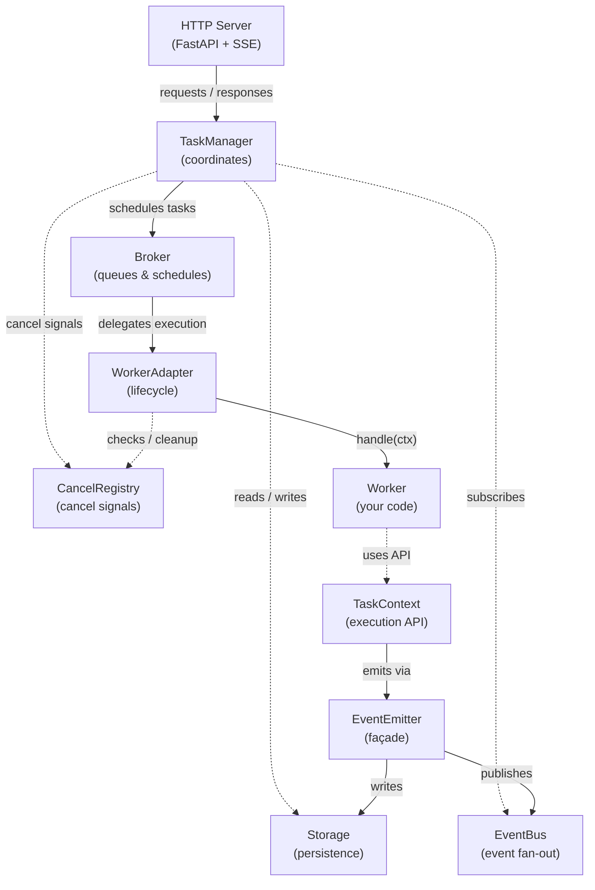

# agentserve

A2A-compliant agent framework. One `Worker` class, one `handle()` method, all endpoints auto-registered.

## Setup

```bash
uv sync
```

For the LangGraph example:

```bash
uv sync --extra langgraph
```

## Architecture

`agentserve` allows you to bring your own `Storage`, `Broker`, `EventBus`, `CancelRegistry` and `Worker`.
You can also leverage the in-memory implementations of `Storage` and `Broker` by using `InMemoryStorage` and `InMemoryBroker`.

Let's have a look at how those components fit together:



**TaskManager** handles submission, validation, streaming, and cancellation. It coordinates between Broker, Storage, EventBus, and CancelRegistry — but never touches the Worker directly.

**WorkerAdapter** bridges the Broker queue to your Worker. It manages the lifecycle: dequeue → check cancel → build context → transition to `working` → call `handle(ctx)` → cleanup.

**EventEmitter** is the façade that TaskContext uses to persist state (Storage) and broadcast events (EventBus) without knowing about either directly. Storage writes are authoritative; EventBus is best-effort.

**Pluggable backends:** Swap `Storage`, `Broker`, `EventBus`, and `CancelRegistry` independently — e.g. PostgreSQL storage + Redis broker + Redis event bus. All backends implement their respective ABC.

## Examples

Three examples in the project root, each a standalone A2A agent:

| File | Pattern | Description |
| --- | --- | --- |
| `example_1.py` | Simple response | Returns text, framework handles artifacts + completion |
| `example_2.py` | Streaming artifacts | Emits word-by-word chunks via `ctx.emit_text_artifact()` |
| `example_3.py` | LangGraph pipeline | Runs a LangGraph graph with custom streaming, no LLM |

### Run

```bash
uv run uvicorn example_1:app --reload
uv run uvicorn example_2:app --reload
uv run uvicorn example_3:app --reload
```

### Test

```bash
curl http://localhost:8000/v1/health
curl http://localhost:8000/.well-known/agent-card.json

curl -X POST http://localhost:8000/v1/message:send \
  -H "Content-Type: application/json" \
  -d '{
    "message": {
      "role": "user",
      "messageId": "00000000-0000-0000-0000-000000000001",
      "parts": [{"kind": "text", "text": "Hello!"}]
    }
  }'

# Stream (SSE)
curl -N -X POST http://localhost:8000/v1/message:stream \
  -H "Content-Type: application/json" \
  -d '{
    "message": {
      "role": "user",
      "messageId": "00000000-0000-0000-0000-000000000002",
      "parts": [{"kind": "text", "text": "Hello!"}]
    }
  }'

# Get task by ID (replace with a real task ID from a previous response)
curl http://localhost:8000/v1/tasks/TASK_ID_HERE
```

## How it works

You implement `Worker.handle(ctx)`. That's the only thing you write. The framework does everything else: state machine, persistence, streaming, artifact management, agent card discovery.

- **Simple**: call `ctx.complete("your answer")` and the framework creates the artifact, persists the message, marks completed.
- **Streaming**: call `ctx.emit_text_artifact(chunk, append=True)` for each chunk, then `ctx.complete()`.
- **Progress**: call `ctx.send_status("Step 1...")` for intermediate updates.
- **JSON**: call `ctx.complete_json({"key": "value"})` to complete with structured data.

## SkillConfig

Define agent skills without importing A2A types:

```python
from agentserve import A2AServer, AgentCardConfig, SkillConfig, Worker

server = A2AServer(
    worker=MyWorker(),
    agent_card=AgentCardConfig(
        name="My Agent",
        description="Does things",
        skills=[
            SkillConfig(
                id="translate",
                name="Translate",
                description="Translates text between languages",
                tags=["translation", "language"],
                examples=["Translate 'hello' to French"],
            ),
        ],
    ),
)
```

## TaskContext API

| Method / Property | Description |
| --- | --- |
| `ctx.user_text` | The user's input as plain text |
| `ctx.parts` | Raw message parts (text, files, etc.) |
| `ctx.task_id` | Current task UUID |
| `ctx.context_id` | Conversation / context identifier |
| `ctx.message_id` | ID of the triggering message |
| `ctx.metadata` | Arbitrary metadata from the request |
| `ctx.is_cancelled` | Check if cancellation was requested |
| `ctx.turn_ended` | Whether a terminal method was called |
| `ctx.files` | File parts as `list[FileInfo]` (content, url, filename, media_type) |
| `ctx.data_parts` | Structured data parts as `list[dict]` |
| `ctx.history` | Previous messages in this task (`list[HistoryMessage]`) |
| `ctx.previous_artifacts` | Artifacts from prior turns (`list[PreviousArtifact]`) |
| `ctx.complete(text?)` | Mark task completed with optional text artifact |
| `ctx.complete_json(data)` | Complete with a JSON data artifact |
| `ctx.respond(text?)` | Complete with a direct message (no artifact) |
| `ctx.reply_directly(text)` | Return a Message directly without task tracking |
| `ctx.fail(reason)` | Mark task failed |
| `ctx.reject(reason?)` | Reject the task |
| `ctx.request_input(question)` | Ask user for more input |
| `ctx.request_auth(details?)` | Request secondary authentication |
| `ctx.send_status(msg)` | Emit intermediate status update |
| `ctx.emit_text_artifact(...)` | Emit a text artifact chunk |
| `ctx.emit_data_artifact(data)` | Emit a structured data artifact chunk |
| `ctx.emit_artifact(...)` | Emit an artifact with any content (text, data, file_bytes, file_url) |
| `ctx.load_context()` | Load stored context for this conversation |
| `ctx.update_context(data)` | Store context for this conversation |

## A2A Endpoints (auto-registered)

| Endpoint | Method | Description |
| --- | --- | --- |
| `/v1/message:send` | POST | Submit task (blocking) |
| `/v1/message:stream` | POST | Submit task (SSE stream) |
| `/v1/tasks/{id}` | GET | Get task by ID |
| `/v1/tasks` | GET | List tasks (filterable, paginated) |
| `/v1/tasks/{id}:cancel` | POST | Cancel a task |
| `/v1/tasks/{id}:subscribe` | POST | Subscribe to task updates (SSE) |
| `/.well-known/agent-card.json` | GET | Agent discovery card |
| `/v1/health` | GET | Health check |

## Custom Backends

Implement `Storage`, `Broker`, `EventBus`, or `CancelRegistry` ABCs and pass them to `A2AServer`:

```python
from agentserve import A2AServer, AgentCardConfig

server = A2AServer(
    worker=MyWorker(),
    agent_card=AgentCardConfig(name="My Agent", description="Does things"),
    storage=MyPostgresStorage(dsn="..."),
    broker=MyRedisBroker(url="redis://..."),
    event_bus=MyRedisEventBus(url="redis://..."),
)
```

All four backends are independently swappable. The in-memory defaults (`"memory"`) are suitable for development and single-process deployments.
