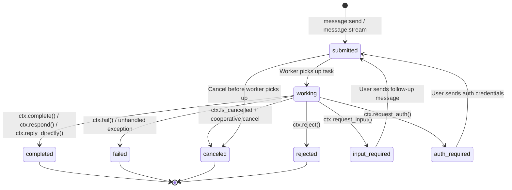

# Task Lifecycle

Every task in a2akit follows a well-defined state machine. Understanding these states is key to building robust agents.

## State Machine

## States

### `submitted`

The task has been created and enqueued for processing. The Broker will deliver it to the WorkerAdapter, which transitions it to `working`.

For follow-up messages (after `input_required` or `auth_required`), the task returns to `submitted` and is re-enqueued.

### `working`

The worker is actively processing the task. During this state, the worker can:

- Emit status updates via `ctx.send_status()`
- Stream artifacts via `ctx.emit_text_artifact()` or `ctx.emit_data_artifact()`
- Transition to any terminal or paused state

### `completed`

The task finished successfully. Reached via `ctx.complete()`, `ctx.respond()`, or `ctx.reply_directly()`. This is a **terminal state**.

### `failed`

The task encountered an error. Reached via `ctx.fail()` or when an unhandled exception escapes `handle()`. This is a **terminal state**.

### `canceled`

The task was canceled. This can happen cooperatively (worker checks `ctx.is_cancelled`) or via force-cancel after a timeout. This is a **terminal state**.

### `rejected`

The agent decided not to perform the task. Reached via `ctx.reject()`. This is a **terminal state**.

### `input_required`

The agent needs more information from the user. Reached via `ctx.request_input()`. The client should send a follow-up message, which transitions the task back to `submitted`.

### `auth_required`

The agent needs authentication credentials. Reached via `ctx.request_auth()`. The client provides credentials in a follow-up message, transitioning back to `submitted`.

## Terminal vs. Paused States

| Type | States | Can receive messages? | Behavior |
|------|--------|-----------------------|----------|
| **Terminal** | `completed`, `failed`, `canceled`, `rejected` | No | Task is done. Storage rejects further state transitions. |
| **Paused** | `input_required`, `auth_required` | Yes (user role) | Waiting for user input. Follow-up re-submits the task. |

## Optimistic Concurrency Control (OCC)

a2akit uses OCC to prevent concurrent writers from corrupting task state. Each task has a version number that is incremented on every write. When updating a task, the caller provides the expected version — if it doesn't match, a `ConcurrencyError` is raised.

This protects against race conditions like:

- Worker completing a task while TaskManager force-cancels it
- Two follow-up messages arriving simultaneously

The `TaskContext` handles OCC automatically — you don't need to manage versions in your worker code.

## Terminal-State Guard

Once a task reaches a terminal state, Storage rejects any further state transitions by raising `TaskTerminalStateError`. This ensures that:

- A completed task can't be failed or canceled
- A canceled task can't be completed
- The first writer wins — subsequent writers get a clear error

!!! note
    Pure message or artifact appends without a state transition (`state=None`) are not affected by the terminal-state guard.
