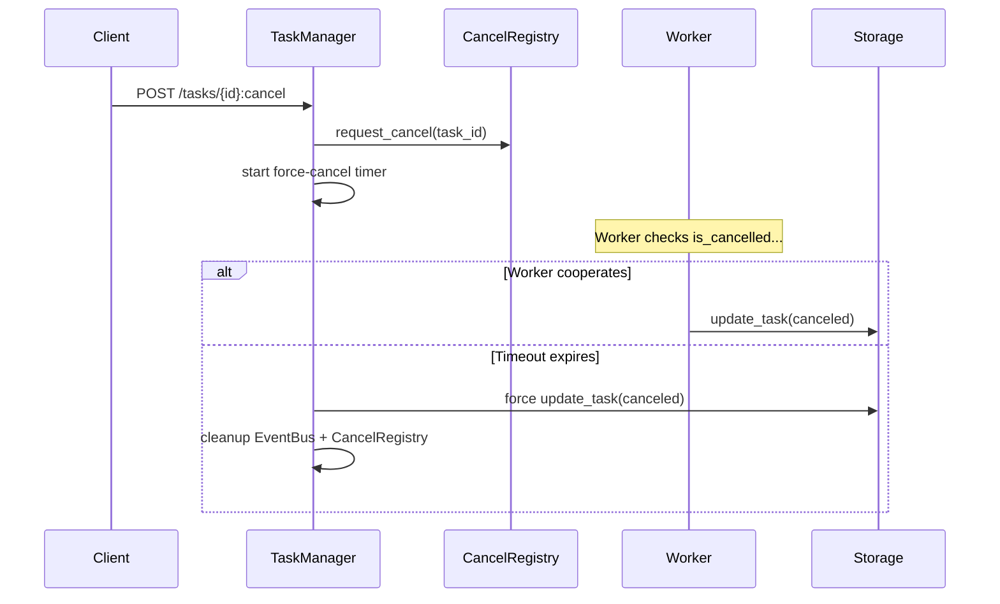

# Cancellation

a2akit supports two cancellation modes: cooperative cancel (worker checks a flag) and force-cancel (timeout fallback). Together, they ensure tasks don't get stuck.

## Cooperative Cancellation

The worker checks `ctx.is_cancelled` at natural checkpoints:

```python
import asyncio
from a2akit import Worker, TaskContext


class LongRunningWorker(Worker):
    async def handle(self, ctx: TaskContext) -> None:
        for i in range(100):
            if ctx.is_cancelled:  # (1)!
                await ctx.fail("Cancelled by user")
                return

            await ctx.send_status(f"Step {i + 1}/100")
            await asyncio.sleep(0.5)

        await ctx.complete("All done!")
```

1. `is_cancelled` is a non-blocking check against the CancelRegistry. Place it in your processing loop.

When a client sends `POST /v1/tasks/{task_id}:cancel`:

1. **CancelRegistry** records the cancellation signal
2. Worker's next `ctx.is_cancelled` check returns `True`
3. Worker handles it gracefully (call `fail()`, `complete()`, or any lifecycle method)

## Force-Cancel

If the worker doesn't cooperate within the timeout, TaskManager forces the transition:



The force-cancel timeout is configurable:

```python
server = A2AServer(
    worker=MyWorker(),
    agent_card=AgentCardConfig(...),
    cancel_force_timeout_s=120.0,  # default: 60.0
)
```

Or via environment variable:

```bash
export A2AKIT_CANCEL_FORCE_TIMEOUT=120
```

## CancelRegistry

The `CancelRegistry` ABC manages cancellation signals:

| Method | Description |
|--------|-------------|
| `request_cancel(task_id)` | Signal cancellation for a task |
| `is_cancelled(task_id)` | Check if cancellation was requested |
| `on_cancel(task_id)` | Return a `CancelScope` that signals when cancelled |
| `cleanup(task_id)` | Release resources for a completed task |

The default `InMemoryCancelRegistry` uses `asyncio.Event` objects. For distributed deployments, implement a Redis-backed registry.

## Cancel Semantics

!!! note "Cancel always goes through CancelRegistry"
    There is no instant-cancel path — even for `submitted` tasks. This avoids a race condition where both TaskManager and WorkerAdapter could write to the same task concurrently.

    The worker checks `is_cancelled` before transitioning to `working`, so submitted tasks are canceled promptly when dequeued.

!!! tip "Cancelled tasks in your worker"
    You can transition to any terminal state when handling cancellation. Use `ctx.fail("Cancelled")` for a clear message, or `ctx.complete()` if you want to save partial results.
